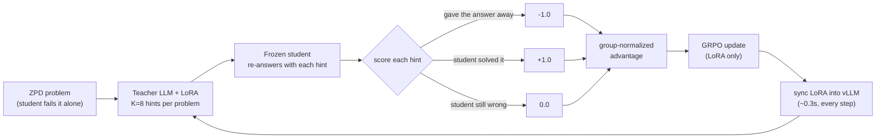
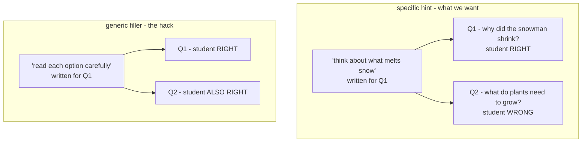
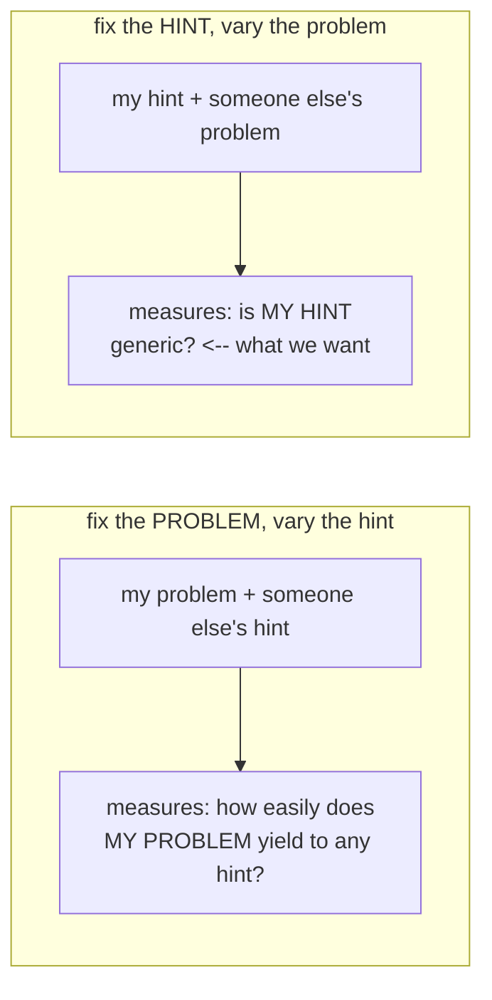

# grpo_tutor

A hand-rolled GRPO stack that trains a **teacher** LLM to tutor a frozen **student**
LLM. The teacher sees a question the student cannot solve and writes a short hint
(never the answer); the student retries; the reward is whether it now gets it right.
Runs on 1x H100 with vLLM.

---

## How one training step works



The student is the **environment**: frozen, never trained. Only the teacher learns.

## The swapped-hint check (specificity)

A hint can raise the student's score two ways. One is teaching. The other is
generic filler - *"read each option carefully and rule out the silly ones"* -
which lifts accuracy on **any** question and costs the teacher no understanding
at all. Both look identical if you only measure "did the student get it right".

The swapped hint separates them: **take a hint and apply it to a different
question.** A real teaching hint stops working. Filler keeps working.



`specificity = solved(own hint) - solved(swapped hint)`. High means the gain was
question-specific; near zero means the hint would have worked on anything.

**Measured on QASC at step 25:** teacher 0.500, swapped 0.400, baseline 0.250 -
so of the +0.250 gain, only **+0.100 was question-specific** and 60% was generic.

### Which way to swap matters

Two different things get called "swapping", and they measure opposite things:



As an aggregate eval statistic either is defensible, and `eval/specificity`
currently uses the first. As a **per-sample training reward** only the second
works, because GRPO centers rewards within the group:

```
advantage_k  ∝  (solved_k - mean solved) - (swapped_k - mean swapped)
```

Only the *deviation* of the swapped term survives. Make it constant across the
group and it cancels exactly; make it depend on someone else's hint and it
becomes noise attributed to the wrong sample. It has to vary **because the
member's own hint varies**.

> Status: `eval/specificity` (measurement) is implemented. The specificity
> *reward* is proposed and under review on a fork branch, not merged.

---

## Biggest things this accomplishes

**1. It proved the reward signal exists before spending any training compute.**
The whole idea only works on problems the student fails alone but solves with help.
`zpd_filter.py` measured that empirically across 4,957 OpenBookQA items (baseline
37.95% -> 47.53% with an oracle hint) and curated the **731 problems** where the
gap is real. `data/zpd_problems.jsonl` is still that OpenBookQA set - the QASC
default landed after it was built, and rebuilding it needs a GPU.
Without this the reward would have had no gradient and no amount of RL tuning
would have shown it.

**2. A working GRPO implementation, written from scratch.**
Group-relative advantage, clipped importance ratio, KL-to-reference via LoRA
disable, teacher-token masking - batched, micro-batched, with the frozen reference
cached once per step (halves the forward passes) and fused `cross_entropy` instead
of materializing a `(B,L,V)` log-softmax.

**3. Production training infra on a single GPU.**
vLLM colocated with the trainer via sleep/wake (**0.3s**, frees 30GB), LoRA weight
sync through a RAM disk (**0.3s**, so syncing *every step* is affordable and
training stays fully on-policy), preemption-safe checkpoint/resume, and a wandb run
that stays continuous across Slurm requeues.

**4. Reward hacking is measured and actively suppressed - not assumed away.**
`LeakGuard` makes leaking the answer (-1.0) strictly worse than honestly failing
(0.0). Five live detectors (leakage, repetition, group collapse, reward-length
correlation, length growth) plus a transfer check. This paid off concretely:
giving the teacher a proper system prompt in its chat format cut leaking
**~4x (0.70 -> 0.16)** and flipped mean reward from negative to positive.

**5. Clean seams for other people.**
`interfaces.py` is pure types - a teammate can implement `Student` or
`RewardModel` and drop it in without touching the training stack. Any reward model
wrapped in `LeakGuard` inherits leak protection for free.

---

## Measured results

| what | number |
|---|---|
| ZPD headroom, OpenBookQA (4,957 items) | 37.95% -> 47.53% (**+9.58%**) |
| Curated training set | **731** problems (0% -> 100% by construction) |
| Untrained 3B teacher | captures **42.7%** of ceiling, 2.7% leak (greedy) |
| Base vs instruct student | +14.0% vs +13.0% - a wash, so instruct kept |
| Throughput | ~4.6s/step (2.2 gen + 2.2 update + 0.3 sync) |

## Run

Everything below assumes **one** H100.

```bash
python src/zpd_filter.py --limit 5000    # 1. build the ZPD set (QASC by default)
sbatch scripts/train_real.sbatch         # 2. train (H100, preemptable, auto-resumes)
python src/evals.py --teacher-adapter checkpoints/adapter-latest   # 3. evaluate
python src/train_h100.py --backend stub --steps 6                  # no-GPU smoke test
```

Useful flags: `--turns 3` (multi-turn dialogue), `--hint-probe` (leak probe),
`--eval-every 25 --eval-n 30` (held-out benchmark during training),
`--eval-benchmark qasc` (evaluate on an unfiltered external set),
`--seed 0` (see Reproducibility), `--self-stop` (the teacher ends the dialogue),
`--student-answer-mode free` (change the reward channel - read the warning below).

### The training task: QASC

`zpd_filter.py --source qasc|openbookqa` picks the corpus to curate from; both
load through `benchmarks.py`, so there is one loader per corpus rather than a
copy inside the filter. **QASC is the default.** OpenBookQA answers are one-word
factual recall, which makes "correct the misconception" and "reveal the answer"
the same sentence; QASC items need two facts composed, so a tutor can supply one
and leave the join to the student. It also has 6x the headroom (see the table
below).

The curation pool is the corpus's **train** split (`qasc_train` / `obqa_train`)
and the eval sets are the validation/test splits, so `--eval-benchmark qasc`
never scores an item the teacher trained on. `load_zpd` prints the source mix of
whatever `data/zpd_problems.jsonl` currently holds, because the filter overwrites
that file in place and the filename does not say which corpus produced it.

### Self-stopping dialogues

`--self-stop` adds a rule to the teacher's system prompt: end your turn with
`[DONE]` once the student can take it from here. The marker is stripped before
the student sees the transcript and before the leak rules read the tutor text -
otherwise the control token is scored as tutoring. `self_stop_rate` (fraction of
dialogues the teacher ended) is logged next to `mean_turns`.

It **disables** `stop_when_solved`, which is the oracle early-stop. Running both
is pointless: the oracle stop fires first, on the turn the student becomes able
to answer, so a teacher that would have rambled for three more turns never pays
for it, and `[DONE]` has no consequence to learn from.

### Reproducibility

`--seed N` (default 0) seeds `random`, torch (CPU and all CUDA devices), numpy,
the train/test split, the problem sampler, and - when the installed vLLM accepts
one - a per-call `SamplingParams.seed` keyed on `(seed, step)` so a Slurm requeue
resumes the stream instead of replaying step 0. The frozen student samples its
dialogue turns from torch's global generator, so seeding at startup covers those
without touching `HFStudent.reply`.

What this does **not** promise:

- **vLLM is not bit-reproducible.** Under continuous batching, which requests
  share a batch depends on timing, and a token's numerics depend on the batch it
  was computed in. Same seed, same prompt, occasionally different text.
- `torch.use_deterministic_algorithms(True)` is deliberately not set: several
  kernels then fall back to slow paths or raise, and that is a worse trade than
  residual nondeterminism.
- Stub-mode numbers also need `PYTHONHASHSEED=0` exported in the shell -
  `StubStudent` keys off `hash(question)` and the salt is fixed before the
  process starts, so it cannot be set from inside.

Treat the seed as "same data order, same starting weights, comparable run",
not as "identical bytes".

### Choosing an eval set

`python src/benchmarks.py --list` shows the available sets;
`python src/bench_baseline.py` measures what the student scores on each. Measured
for Qwen2.5-0.5B-Instruct over 150 items:

| set | chance | baseline | oracle hint | headroom |
|---|---|---|---|---|
| qasc (8-way) | 0.125 | 0.253 | 0.893 | **+0.64** |
| sciq | 0.250 | 0.687 | 0.970 | +0.28 |
| obqa_test | 0.250 | 0.313 | 0.413 | +0.10 |
| arc_easy | 0.249 | 0.533 | - | - |
| geography | 0.250 | 0.427 | - | - |
| commonsense | 0.200 | 0.393 | - | - |
| arc_challenge | 0.251 | 0.353 | - | - |

**qasc** is the default for training and the recommended eval set: the largest
teachable gap by far, 8-way so guessing adds less noise, and its answers require
composing two facts - which is work a tutor can actually do across turns rather
than leak in one line.

### How the student commits to an answer

The reward is `student.choose(...)`: options ranked by length-normalized log-prob
behind a bare `Fact: ...\nQuestion: ...\nAnswer:` prompt, with no chat template
and no room to reason. That channel is stricter than the student's actual
ability - on 120 problems where `choose()` scored 1%, the same student answered
26% correctly in free text.

`--student-answer-mode free` switches the reward to `choose_free()`, which lets
the student write one sentence and maps it back to an option (falling back to
`choose()` when it commits to nothing). It is **off by default**, because moving
it moves the reward: the curated ZPD set was selected by `choose()` failing, and
every baseline in this README was measured through `choose()`.

`python src/check_answer_modes.py --source qasc --limit 100` measures the gap.
Qwen2.5-0.5B-Instruct over 100 QASC train items:

| condition | log-prob | free text | the two agree |
|---|---|---|---|
| alone | 0.200 | 0.250 | **0.170** |
| with the oracle hint | 0.940 | 0.620 | 0.580 |

Unaided, the channels agree on 17% of items - barely above the 12.5% two
independent 8-way guesses would hit. They are close to *different measurements*,
not two views of one ability, and the ZPD keep rate ("fails alone AND solves with
help") moves from **0.74 to 0.41** with the switch. 0.5% of free replies named no
option and fell back to `choose()`.

## Layout

```
src/      the code            scripts/  slurm jobs + env.sh
data/     problems + personas runs/     traces, metrics, samples (gitignored)
```

`config.py` knobs · `engine.py` vLLM/HF/stub inference + sleep/wake/sync ·
`grpo.py` the GRPO loss · `tasks.py` problems + prompts · `rewards.py`
SolveReward + LeakGuard · `zpd_filter.py` ZPD curation + student ·
`benchmarks.py` corpora (curation pools + eval sets) · `evals.py` held-out eval ·
`monitor.py` traces + metrics + hack detectors · `train_h100.py` training loop ·
`seeding.py` every RNG in one call · `interfaces.py` seams ·
`paths.py` repo-root anchors · `check_answer_modes.py` log-prob vs free-text reward channel

Data and output paths are anchored to the repo root, so scripts work from any
working directory - a requeued job cannot miss `checkpoints/` and silently
restart from step 0.

## Watching a run

- **wandb** - loss/reward/KL/`zero_adv_frac`/hack metrics, plus a `samples` table of
  actual hints. Live, no port-forwarding.
- **`tail -f runs/*/samples.md`** - best/worst hints with the student's answer.
- **`traces.jsonl`** - every sample; `grep "HACK?" logs/train_*.out` for alerts.

Key metrics: `leak_rate` (should stay low), `solved_rate` (should rise),
`zero_adv_frac` (groups with no reward variance contribute **zero** gradient - if
this nears 1.0 the data has stopped providing signal), `clip_frac` (near 0 early).

The one that actually separates learning from hacking is `eval/teaching_gain` on
held-out problems the teacher never trains on. If training reward climbs while
that stays flat, the reward is being gamed.

## Known open issues

- **QASC's oracle hint mostly contains the answer.** Measured over all 8,134
  train items with `rewards.leak_signals`, `combinedfact` states the gold option
  verbatim in **88.5%** of items and trips the leak rule in **96.7%**
  (OpenBookQA's `fact1`: 5.8% / 10.1%). So the `0.253 -> 0.893` QASC ceiling is
  largely "the student copies the answer out of the hint", and a tutor that never
  leaks cannot reach it. The ZPD screen inherits this: "solves it with help" on
  QASC partly means "can copy". QASC's `fact1` alone trips the rule on 37.2% and
  is the obvious candidate for an honest ceiling, but nothing uses it yet.
- **Self-stop and the free answer channel are stub-tested only.** `--self-stop`
  and `--student-answer-mode free` run end to end in stub mode; neither has been
  through a GPU run, so there is no evidence yet that the 3B teacher emits
  `[DONE]` at sensible moments or that the free channel's mapping holds up on
  real replies.
- **Generic-filler hack is unsolved.** At eval, ~70% of the teacher's gain survived
  swapping hints between problems, i.e. much of it is not question-specific. No
  detector catches this; the check is `teaching_gain` vs `transfer_gain` in
  `evals.py`. A specificity-adjusted reward (`solved(own) - solved(swapped)`) is the
  proposed fix and is **not implemented**.
- **No full training run has been done yet** - only smoke tests up to 6 steps. The
  encouraging early numbers are far too short to call a trend.
- **`eval/teaching_gain` equals `eval/teacher_acc` on the default eval set.** The
  ZPD filter keeps only problems the student fails alone, so held-out
  `baseline_acc` is 0.0 by construction and the baseline term subtracts nothing.
  Pass `--eval-benchmark qasc` (or any set above) to get a real baseline.
- **The leak probe is missing its control and is currently uninterpretable.**
  `hint_only_leak` (0.33-0.40 on QASC) is a partial-input baseline, and we never
  measured what the student scores on *choices alone*. LLMs beat majority
  baselines on choices-only prompts routinely, so an unknown share of that number
  is the student exploiting the distractors, not the teacher leaking. It also
  cannot distinguish leaking from legitimately nudging a student who already
  half-knew the answer. See `docs/eval_leakage.md` for the controls needed.
- **Multi-turn is verified in stub mode only.** `--turns > 1` runs the dialogue loop
  (student asks -> teacher guides -> student retries), masks loss to teacher tokens,
  and shares the terminal reward across turns, but it has not yet run on a GPU.
- Multi-GPU support was **removed**, not just disabled: 2-GPU queue times made it
  untestable, and untested concurrency code is worse than none. Single GPU is the
  only configuration.
