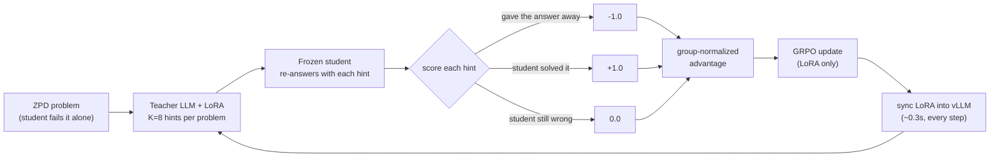
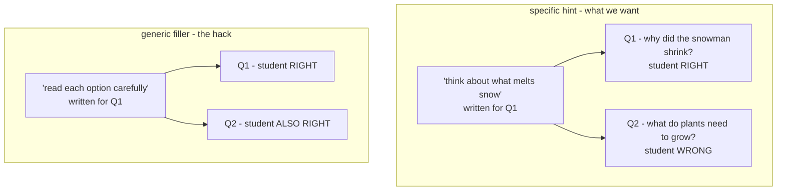
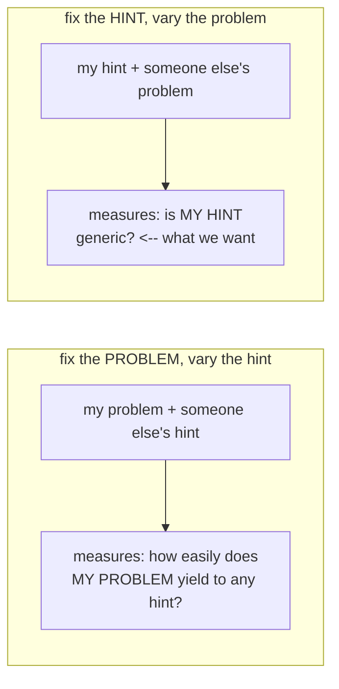
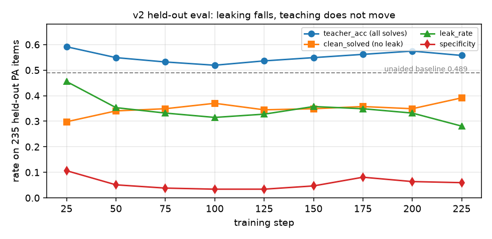
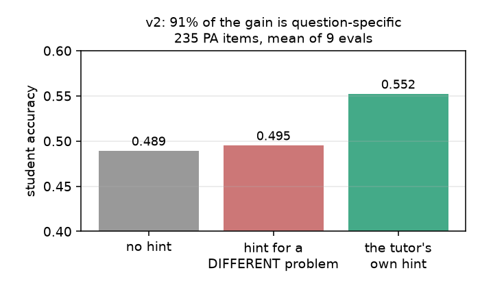
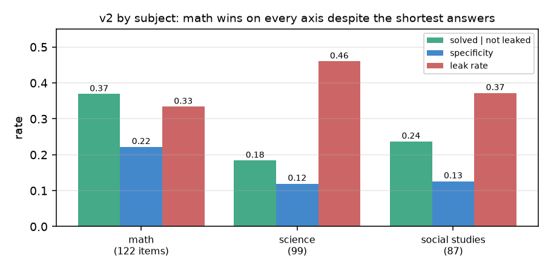

# grpo_tutor

A hand-rolled GRPO stack that trains a **teacher** LLM to tutor a frozen **student**
LLM. The teacher sees a question the student cannot solve and writes a short hint
(never the answer); the student retries; the reward is whether it now gets it right.
Runs on 1x H100 with vLLM.

---

## How one training step works




The student is the **environment**: frozen, never trained. Only the teacher learns.

## The swapped-hint check (specificity)

A hint can raise the student's score two ways. One is teaching. The other is
generic filler - *"read each option carefully and rule out the silly ones"* -
which lifts accuracy on **any** question and costs the teacher no understanding
at all. Both look identical if you only measure "did the student get it right".

The swapped hint separates them: **take a hint and apply it to a different
question.** A real teaching hint stops working. Filler keeps working.




`specificity = solved(own hint) - solved(swapped hint)`. High means the gain was
question-specific; near zero means the hint would have worked on anything.

**Measured on Pennsylvania in v2**, averaged over nine evals of 235 items:
teacher 0.552, swapped 0.495, baseline 0.489 — so of the +0.063 gain, **+0.057
is question-specific** and the generic component is +0.006. On OpenBookQA in v0
it was the other way round: swapping cost nothing, and the gain was filler.

### Which way to swap matters

Two different things get called "swapping", and they measure opposite things:




As an aggregate eval statistic either is defensible, and `eval/specificity`
currently uses the first. As a **per-sample training reward** only the second
works, because GRPO centers rewards within the group:

```
advantage_k  ∝  (solved_k - mean solved) - (swapped_k - mean swapped)
```

Only the *deviation* of the swapped term survives. Make it constant across the
group and it cancels exactly; make it depend on someone else's hint and it
becomes noise attributed to the wrong sample. It has to vary **because the
member's own hint varies**.

> Status: both are implemented and shipped. `--specificity difference` has been
> the training reward since v1. It has not moved specificity in either run that
> used it — see the v3 notes at the end of `[docs/run_v2.md](docs/run_v2.md)`.

---


## Biggest things this accomplishes

**1. It proved the reward signal exists before spending any training compute.**
The whole idea only works on problems the student fails alone but solves with help.
`zpd_filter.py` measured that empirically across 4,957 OpenBookQA items (baseline
37.95% -> 47.53% with an oracle hint) and curated the problems where the gap is
real. The live set, `data/zpd_problems.jsonl`, is **549 items screened on BOTH
answer channels** - the student must fail under `choose()` *and* be unable to
produce the answer in free text, because 26% of the single-channel set turned out
to be answerable when simply asked. Without this the reward would have had no
gradient and no amount of RL tuning would have shown it.

**2. A working GRPO implementation.**
Group-relative advantage, clipped importance ratio, KL-to-reference via LoRA
disable, teacher-token masking - batched, micro-batched, with the frozen reference
cached once per step (halves the forward passes) and fused `cross_entropy` instead
of materializing a `(B,L,V)` log-softmax.

**3. Production training infra on a single GPU.**
vLLM colocated with the trainer via sleep/wake (**0.3s**, frees 30GB), LoRA weight
sync through a RAM disk (**0.3s**, so syncing *every step* is affordable and
training stays fully on-policy), preemption-safe checkpoint/resume, and a wandb run
that stays continuous across Slurm requeues.

**4. Reward hacking is measured and actively suppressed - not assumed away.**
`LeakGuard` makes leaking the answer (-1.0) strictly worse than honestly failing
(0.0). Five live detectors (leakage, repetition, group collapse, reward-length
correlation, length growth) plus a transfer check. This paid off concretely:
giving the teacher a proper system prompt in its chat format cut leaking
**~4x (0.70 -> 0.16)** and flipped mean reward from negative to positive.

**5. Clean seams for other people.**
`interfaces.py` is pure types - a teammate can implement `Student` or
`RewardModel` and drop it in without touching the training stack. Any reward model
wrapped in `LeakGuard` inherits leak protection for free.

---


## Results: v0 → v1 → v2 → v3 → v3-leakfix

**Every run has its own write-up in `docs/run_vN.md`. Go there for the specifics,
the caveats, and the mid-run readings that turned out to be noise — this section
is the through-line only.**

| run | the one thing it changed | write-up |
|---|---|---|
| v0 | first clean multi-turn run | [`docs/run_v0.md`](docs/run_v0.md) |
| v1 | added the specificity reward | [`docs/run_v1.md`](docs/run_v1.md) |
| v2 | swapped OpenBookQA for real state assessments | [`docs/run_v2.md`](docs/run_v2.md) |
| v3 | added a learned teaching score — stopped, the head reads provenance | [`docs/run_v3.md`](docs/run_v3.md) |
| v3-leakfix | corrected the leak rule, alone | [`docs/run_v3_leakfix.md`](docs/run_v3_leakfix.md) |

Two supporting analyses have their own documents:
[`docs/leak_calibration.md`](docs/leak_calibration.md), which measures the leak
detector against 1,104 rated turns, and
[`docs/dataset_choice.md`](docs/dataset_choice.md), on how each corpus was chosen
or rejected.


|                   | v0                 | v1                | v2                             | v3                     | v3-leakfix                |
| ----------------- | ------------------ | ----------------- | ------------------------------ | ---------------------- | ------------------------- |
| job               | `19371176`         | `19392772`        | `19405111`                     | `19461561`             | `19468005`                |
| steps / dialogues | 500 / 16,000       | 250 / 8,064       | 250 / 8,000                    | **105, stopped**       | 250 / 8,000               |
| training set      | 549 ZPD OpenBookQA | same              | **307 state-assessment items** | same                   | same                      |
| reward            | leak + solved      | **+ specificity** | same                           | **+ learned teaching** | **corrected leak rule**   |
| eval set          | 40 QASC            | 200 QASC          | **235 Pennsylvania**           | same                   | same                      |
| KL coef           | 0.05               | 0.05              | 0.03                           | 0.03                   | 0.03                      |
| held-out leak     | 0.325 → 0.075      | 0.260 → 0.135     | 0.455 → 0.281                  | 0.230 → 0.217          | 0.234 → 0.174             |
| specificity       | ~0.00, flat        | +0.092, flat      | +0.057, flat                   | —                      | flat                      |
| teacher_acc       | flat               | flat              | flat                           | flat                   | **+0.008, t=+0.30**       |
| weights           | `checkpoints-v0/`  | `checkpoints-v1/` | `checkpoints-v2/`              | —                      | `checkpoints/v3lf/`       |

Leak rates are **not comparable** from v3 onward: the rule changed, and a
narrower rule flags fewer turns whatever the policy does. `teacher_acc` is
comparable throughout, and it has never moved.

**Four runs reduced leaking. None improved teaching.** That now survives two
reward changes, a corpus change, and a corrected detector.

v3 was the attempt to fix the objective rather than the rule: v2 showed the
student's answer channel sees only +0.07 of a quality difference that raters put
at +1.75 of 5, so a learned score was supposed to give the reward eyes. It was
stopped at step 105. The head turns out to read **provenance** — the two label
tiers differ by style as much as by quality, tier is recoverable from the
embedding at spearman 0.833, and within the policy tier, the only regime that
exists during RL, its within-question ranking falls from 0.760 to 0.581.
Optimising it drove the question rate from 79% to 32% while held-out
`clean_solved` stayed flat.

**v3-leakfix** then isolated the other suspect. The leak rule had been paying −1
on 17.9% of turns to punish a 6.4% behaviour, and the penalty *replaces* the
reward rather than adjusting it, so the suspicion was that the policy had been
punished at random for four runs. Corrected, precision on math more than doubles
— and `teacher_acc` still does not move. The rule was worth fixing. It was not
the thing.

What is left is not about the reward. The leading explanation is that a 0.5B
student cannot use hints at all: if expert hand-written tutoring shifts its
answers by +0.07, no reward computed from that student's accuracy can carry more
signal than that.

**v0** established the pattern: leaking halved while the solve rate on
non-leaked dialogues sat flat at 0.32. It also found specificity ≈ 0 — a hint
written for a *different problem* helped as much as the right one — so the
+0.100 gain was generic help, not teaching.

**v1** added the specificity reward (`solved(own) − solved(other problem | same hint)`) on the same corpus. Specificity did not move. That run also turned out
not to be the clean A/B its header claimed: an oracle early stop had landed in
the dialogue loop, and because `heldout_eval` shares that loop, the own-problem
condition got a solve check every turn while the swapped condition got one shot.
Its +0.092 is inflated by that and is not comparable to v0 or v2.

**v2** switched to real state assessments and fixed the eval. Held out on
Pennsylvania — a different state, different authors, different year:


|                                    | start  | end                         |
| ---------------------------------- | ------ | --------------------------- |
| held-out leak rate                 | 0.455  | **0.281**                   |
| solve rate on non-leaked dialogues | 0.547  | 0.544 (flat, 0.534 ± 0.013) |
| `clean_solved` (solved, no leak)   | 0.298  | 0.391                       |
| held-out specificity               | +0.106 | +0.060 (mean +0.057, flat)  |




`clean_solved` rose and it is not teaching: it factors as *how well the tutor
teaches when it stays quiet* × *how often it stays quiet*, and only the second
factor moved. The first held at 0.534 for all 250 steps. Note `teacher_acc`
tracking *down* toward the baseline as leaking falls — the leaked solves
disappearing, which is why the honest metric has to be reported separately.

### What v2 changed about the diagnosis

**Generic help is gone.** This retires v0's central finding. On Pennsylvania,
averaged over nine evals of 235 items:

```
no hint at all                  0.489
a hint for a DIFFERENT problem  0.495    +0.006
the tutor's own hint            0.552    +0.063
```



A wrong-problem hint is worth nothing, so **91% of the gain is question-specific**
— positive in 9 of 9 evals, and +0.162 ± 0.006 across all 8,000 training
dialogues. The help is real. It is just small, and training does not grow it.

**But answer shape was the wrong explanation.** The corpus was switched because
short gold answers supposedly make explaining and revealing the same act. Split
v2 by subject and the opposite holds:


| subject        | items | gold length         | leaked | specificity | solved | clean |
| -------------- | ----- | ------------------- | ------ | ----------- | -------------- |
| math           | 122   | 2 words, 30% single | 0.334  | **+0.222**  | **0.369**      |
| science        | 99    | 6 words, 15% single | 0.460  | +0.120      | 0.184          |
| social studies | 87    | 6 words, 8% single  | 0.372  | +0.126      | 0.237          |




Math has the *shortest* answers — the same shape as OpenBookQA — and wins on
every axis. Grade level barely registers by comparison (0.242 to 0.300 across
bands, against 0.184 to 0.369 across subjects). The likelier axis is that a
maths item has a procedure you can walk someone through without saying the
number, while science and history items are recall, where the explanation is the
answer.

### v3: a learned teaching score in the reward

Details in [`docs/run_v3.md`](docs/run_v3.md). The short version.

**1,104 tutor turns were rated** on two scales — leak 1-3 and teaching quality
1-5 — by a human through the labelling app, a lead agent, and six independent
agents working from a shared rubric with worked examples
(`data/label_slices/RUBRIC.md`). The six never saw each other's work and landed
within 0.11 of each other on the policy tier, which is the evidence that the
rubric transfers rather than each rater inventing a private standard.

**A reward model was fitted on those ratings**: frozen 0.5B backbone, linear head
on the final hidden state. Frozen because GRPO moves the teacher's LoRA and a
head reading a moving trunk scores a moving target. Final position because
attention is causal, so only the last token has read the whole turn. Linear
rather than an MLP because the MLP memorised — train ρ 0.976 against test 0.55,
AUC swinging 0.87-0.94 across splits — while the linear probe holds AUC 0.92 with
a third of the variance and extrapolates predictably when RL pushes
off-distribution. 3B and 7B backbones were no better than 0.5B.

**It enters the reward z-scored within the group:**

```
reward = -1                              if the leak rule fires
       = solved − solved(other) + 0.5·z  otherwise
```

Within-group because GRPO centres advantages inside a group, so only the spread
across one problem's completions survives. A leaked turn keeps its flat −1 and
never receives the bonus. `solved` stays in as the term the head cannot be gamed
against — if the teaching score climbs while held-out `clean_solved` stays flat,
the head is being hacked and it shows within one eval cycle.

The metric that matters for this use is **same-question pairwise ranking, 0.72**,
not the global AUC of 0.92. Global AUC pools comparisons across problems that
GRPO never makes; a head could score well on it by learning that maths items rate
higher than history items and still be useless inside a group.

### Why leaking is learnable and teaching is not

Leaking is unilateral and deterministic: the tutor controls it with its own
tokens, it costs −1, and it fired on 38.5% of v2's dialogues — a dense, certain
gradient. Teaching needs a frozen 0.5B student to flip a log-prob argmax, only
**14.8%** of dialogues earned +1 at all, and a barely-adequate hint scores
identically to an excellent one. The reward can say "solved"; it cannot say
"more specific".

### Infrastructure


| what                                   | number                                          |
| -------------------------------------- | ----------------------------------------------- |
| ZPD headroom, OpenBookQA (4,957 items) | 37.95% -> 47.53% (**+9.58%**)                   |
| Base vs instruct student               | +14.0% vs +13.0% - a wash, so instruct kept     |
| Throughput, single-turn                | ~7.7s/step (4.6 gen + 2.7 update + 0.4 sync)    |
| Throughput, 3-turn dialogue            | ~25s/step, ~28s/step in v2 with a 235-item eval |


### The student

`Qwen2.5-0.5B-Instruct`, frozen. Prompting it into a persona provably fails -
rewriting `STUDENT_SYSTEM` into five explicit rules moved the median reply length
by **zero words** (25 before, 25 after). It is instead LoRA-fine-tuned on 1,591
turns (91 hand-written) via `persona_data.py` + `sft_student.py`:

> base: *"Meteorology is the study of weather, climate, and air pressure systems…"*
> tuned: *"like what does meteorology even mean again?"*

The adapter applies to `reply()` only; `choose()` runs with it **disabled**,
because `choose()` is the reward channel and the ZPD curation and every reported
baseline assume it is fixed. `check_persona_safety.py` asserts this and passes
60/60 identical predictions.

## Run

Everything below assumes **one** H100.

The v2 pipeline, which is the current one:

```bash
python src/extract_ca.py                 # 1. rebuild the state items (gitignored)
sbatch scripts/screen.sbatch             # 2. screen them -> data/state_tests/train_items.jsonl
sbatch scripts/train_v1.sbatch           # 3. train (H100, preemptable, auto-resumes)
python src/train_h100.py --backend stub --steps 6    # no-GPU smoke test
```

**Clear** `checkpoints/ckpt.pt` **first unless you mean to resume** — including
before the smoke test, which will otherwise append into the previous run's
directory. Archive finished runs to `checkpoints-vN/` and leave
`student-persona` in place, since it is an input.

The v0/v1 pipeline (OpenBookQA) is still there:
`python src/zpd_filter.py --limit 5000` then `sbatch scripts/train_real.sbatch`.

Useful flags: `--turns 3` (multi-turn dialogue), `--hint-probe` (leak probe),
`--eval-every 25 --eval-n 235` (held-out benchmark during training),
`--eval-benchmark data/state_tests/eval_items.jsonl` (a registry name or a path),
`--specificity difference` (pay only for question-specific help),
`--seed 0` (see Reproducibility), `--self-stop` (the teacher ends the dialogue),
`--student-answer-mode free` (change the reward channel - read the warning below).

### The v0/v1 training task: leak-screened OpenBookQA

`zpd_filter.py --source` picks the corpus to curate from; all pools load through
`benchmarks.py`, so there is one loader per corpus rather than a copy inside the
filter. `openbookqa_honest` **is the default** — OpenBookQA's `fact1`, with the
items whose hint already contains the answer dropped (4,454 of 4,957 left).

QASC was the default until the audit in `docs/dataset_choice.md`, and both of the
reasons for that turned out to be wrong. Its `combinedfact` oracle hint states
the gold option verbatim in 88.5% of items, so the 6x headroom below is mostly
the student copying the answer out of the hint rather than being taught. And the
"OpenBookQA answers are one word" claim does not survive measurement: OpenBookQA
gold answers run a median of 2 words with 31% single-word, while **QASC's are 1
word and 60% single-word**. OpenBookQA's hint tends to state a principle the
student then has to apply — *"as distance to an object increases, that object
will appear smaller"* for gold *"the mountains seem smaller than in
photographs"* — which is the scaffolding move that is not a reveal.

`python src/hint_audit.py --candidates` reproduces the whole survey on a laptop
in under a minute; `race_middle` (24,587 items, 4-word median answers) is the
registered fallback.

The curation pool is the corpus's **train** split (`obqa_train_honest`,
`qasc_train_honest`, `race_middle_train`) and the eval sets are the
validation/test splits (`obqa_honest`, `qasc_honest`, `race_middle`), so
`--eval-benchmark` never scores an item the teacher trained on. `load_zpd` prints the source mix of
whatever `data/zpd_problems.jsonl` currently holds, because the filter overwrites
that file in place and the filename does not say which corpus produced it.

### Self-stopping dialogues

`--self-stop` adds a rule to the teacher's system prompt: end your turn with
`[DONE]` once the student can take it from here. The marker is stripped before
the student sees the transcript and before the leak rules read the tutor text -
otherwise the control token is scored as tutoring. `self_stop_rate` (fraction of
dialogues the teacher ended) is logged next to `mean_turns`.

It **disables** `stop_when_solved`, which is the oracle early-stop. Running both
is pointless: the oracle stop fires first, on the turn the student becomes able
to answer, so a teacher that would have rambled for three more turns never pays
for it, and `[DONE]` has no consequence to learn from.

### Reproducibility

`--seed N` (default 0) seeds `random`, torch (CPU and all CUDA devices), numpy,
the train/test split, the problem sampler, and - when the installed vLLM accepts
one - a per-call `SamplingParams.seed` keyed on `(seed, step)` so a Slurm requeue
resumes the stream instead of replaying step 0. The frozen student samples its
dialogue turns from torch's global generator, so seeding at startup covers those
without touching `HFStudent.reply`.

What this does **not** promise:

- **vLLM is not bit-reproducible.** Under continuous batching, which requests
share a batch depends on timing, and a token's numerics depend on the batch it
was computed in. Same seed, same prompt, occasionally different text.
- `torch.use_deterministic_algorithms(True)` is deliberately not set: several
kernels then fall back to slow paths or raise, and that is a worse trade than
residual nondeterminism.
- Stub-mode numbers also need `PYTHONHASHSEED=0` exported in the shell -
`StubStudent` keys off `hash(question)` and the salt is fixed before the
process starts, so it cannot be set from inside.

Treat the seed as "same data order, same starting weights, comparable run",
not as "identical bytes".

### Choosing an eval set

`python src/benchmarks.py --list` shows the available sets;
`python src/bench_baseline.py` measures what the student scores on each. Measured
for Qwen2.5-0.5B-Instruct over 150 items:


| set           | chance | baseline | oracle hint | headroom | of which reachable         |
| ------------- | ------ | -------- | ----------- | -------- | -------------------------- |
| qasc (8-way)  | 0.125  | 0.253    | 0.893       | +0.64    | **~12%**                   |
| sciq          | 0.250  | 0.687    | 0.970       | +0.28    | unmeasured, hint leaks 96% |
| obqa_test     | 0.250  | 0.313    | 0.413       | +0.10    | unmeasured, hint leaks 15% |
| arc_easy      | 0.249  | 0.533    | -           | -        | -                          |
| geography     | 0.250  | 0.427    | -           | -        | -                          |
| commonsense   | 0.200  | 0.393    | -           | -        | -                          |
| arc_challenge | 0.251  | 0.353    | -           | -        | -                          |


**Read the headroom column with suspicion.** An oracle hint that contains the
answer defines a ceiling no tutor bound by `LeakGuard` can reach. On QASC the
student scores **0.753 from the hint alone with the question hidden**, against a
0.107 choices-only floor - so 0.647 of that +0.64 is copying, and the honest gap
is a rounding error. Screening QASC down to the items whose hint does not name
the answer drops the ceiling to 0.180 -> 0.387 (+0.207), of which 0.147 is still
available without the question.

`python src/bench_baseline.py --probe` reports `hint_only` and its
`choices_only` floor alongside the headroom, which is the only way to tell the
two apart. `python src/hint_audit.py --candidates` gives the string-level version
of the same question for every corpus, with no model and no GPU.
See `docs/dataset_choice.md`.

### How big do the sets need to be?

Worked out after run v0's evals turned out to be uninterpretable. At the n=40 we
were using, the smallest difference that can be trusted is **larger than every
effect we are trying to measure**:


| eval n | SE    | min detectable difference |
| ------ | ----- | ------------------------- |
| 40     | 0.077 | **0.217**                 |
| 150    | 0.040 | 0.112                     |
| 200    | 0.035 | 0.097                     |
| 400    | 0.024 | 0.069                     |


Run v0 measured `teaching_gain` ~ +0.10 and `specificity` ~ 0.00, so its per-eval
movement (+0.05 to +0.175) was noise. **Eval wants ~200 items.** v2 uses all 235
Pennsylvania items, which puts the minimum detectable difference at 0.089.

Training wants **~300-500**. v2 ran 308 items at 3.2 exposures each and its
held-out numbers stayed flat, so there is no memorisation signal at that size —
but below ~200 the teacher sees each problem 6-13 times and can learn
per-problem hints instead of how to tutor.

**250 steps is more than enough.** All three runs plateaued by roughly step 150,
and v2's last 50 steps actively degraded.

### Real state assessments

The v2 training corpus. Items from public state tests, extracted from released
PDFs. They are here because run v0 traced specificity ~0 back to answer *shape*:
when the gold answer is a single word, "correct the misconception" and "reveal
the answer" are the same action. v2 confirmed the corpus fixes the generic-help
problem and refuted the answer-shape explanation for it — see the results above.


| corpus                 | gold answer length | single-word |
| ---------------------- | ------------------ | ----------- |
| state assessments (TX) | median 5 words     | **13%**     |
| ARC-Challenge          | 5                  | 15%         |
| RACE-middle            | 4                  | 19%         |
| OpenBookQA             | 2                  | 31%         |
| QASC                   | 1                  | 60%         |


`src/staar_extract.py` and `src/extract_{pa,ma,ca,nj}.py` download the PDFs and
parse them. Items are self-contained: anything depending on a picture, or on a
passage shared with other questions, is dropped - which removes essentially all
reading, correctly rather than accidentally.

**The split is by state**, so held-out means a different test authored by
different people in a different year, not a random slice of one corpus.
v2 trained on CA + TX + MA + NJ and held out **all 235 Pennsylvania items**,
which are never screened, so the eval baseline is real (0.489 for this student).

> **These files are NOT in git and must not be.** State assessment items are
> state-copyright (Texas: "reproduction prohibited"; Pennsylvania: duplication
> "by Pennsylvania educators for local classroom use" only) and this repo is
> public. `data/staar/` and `data/state_tests/` are gitignored. The extractors
> are ours and are committed; the content is not. Rebuild it locally.

State items carry **no oracle hint**, so `zpd_filter.py` cannot screen them - its
test is "fails alone but solves *with the hint*". `src/baseline_screen.py` is the
replacement: it drops only what the student can already answer unaided. Skipping
it is expensive, and measurably so - an unscreened attempt opened at
`solved=0.97, zero_adv_frac=0.75`, meaning three quarters of the groups produced
no gradient at all. Screened, v2 ran at 0.27.

Both of its channels are multiple choice with a 25% floor, so one correct answer
is weak evidence. The free-text channel therefore samples **3 seeded trials and
drops an item only if all three name gold** — 187 items passed one trial and 59
passed all three, so a single sample was mostly measuring luck. `choose()` is
deterministic and cannot be resampled; a confidence margin was measured as a
substitute and **rejected**, because raising it makes the grade profile invert.
Every item's raw measurements land in `data/state_tests/screen_report.jsonl`, so
a different rule can be re-derived offline with `--replay` and no GPU.

The reframe worth keeping: knowledge is the wrong question for this screen. GRPO
needs variance *within the group*, and since `choose()` is deterministic, an item
it gets right by a surface fluke it gets right at every step. That group yields
no gradient whether the correctness is luck or knowledge, so plain argmax is the
right rule.

### How the student commits to an answer

The reward is `student.choose(...)`: options ranked by length-normalized log-prob
behind a bare `Fact: ...\nQuestion: ...\nAnswer:` prompt, with no chat template
and no room to reason. That channel is stricter than the student's actual
ability - on 120 problems where `choose()` scored 1%, the same student answered
26% correctly in free text.

`--student-answer-mode free` switches the reward to `choose_free()`, which lets
the student write one sentence and maps it back to an option (falling back to
`choose()` when it commits to nothing). It is **off by default**, because moving
it moves the reward: the curated ZPD set was selected by `choose()` failing, and
every baseline in this README was measured through `choose()`.

`python src/check_answer_modes.py --source qasc --limit 100` measures the gap.
Qwen2.5-0.5B-Instruct over 100 QASC train items:


| condition            | log-prob | free text | the two agree |
| -------------------- | -------- | --------- | ------------- |
| alone                | 0.200    | 0.250     | **0.170**     |
| with the oracle hint | 0.940    | 0.620     | 0.580         |


Unaided, the channels agree on 17% of items - barely above the 12.5% two
independent 8-way guesses would hit. They are close to *different measurements*,
not two views of one ability, and the ZPD keep rate ("fails alone AND solves with
help") moves from **0.74 to 0.41** with the switch. 0.5% of free replies named no
option and fell back to `choose()`.

## Layout

```
src/      the code            scripts/  slurm jobs + env.sh
data/     problems + personas runs/     traces, metrics, samples (gitignored)
```

`config.py` knobs · `engine.py` vLLM/HF/stub inference + sleep/wake/sync ·
`grpo.py` the GRPO loss · `tasks.py` problems + prompts · `rewards.py`
SolveReward + LeakGuard · `zpd_filter.py` ZPD curation + student ·
`benchmarks.py` corpora (curation pools + eval sets) · `evals.py` held-out eval ·
`monitor.py` traces + metrics + hack detectors · `train_h100.py` training loop ·
`seeding.py` every RNG in one call · `interfaces.py` seams ·
`paths.py` repo-root anchors · `check_answer_modes.py` log-prob vs free-text reward channel ·
`hint_audit.py` is a corpus tutorable? (leak + answer shape, no model, no GPU)

Data and output paths are anchored to the repo root, so scripts work from any
working directory - a requeued job cannot miss `checkpoints/` and silently
restart from step 0.

## Watching a run

- **wandb** - loss/reward/KL/`zero_adv_frac`/hack metrics, plus a `samples` table of
actual hints. Live, no port-forwarding.
- `tail -f runs/*/samples.md` - best/worst hints with the student's answer.
- `traces.jsonl` - every sample; `grep "HACK?" logs/train_*.out` for alerts.

Key metrics: `leak_rate` (should stay low), `solved_rate` (should rise),
`zero_adv_frac` (groups with no reward variance contribute **zero** gradient - if
this nears 1.0 the data has stopped providing signal), `clip_frac` (near 0 early).

The one that actually separates learning from hacking is `eval/teaching_gain` on
held-out problems the teacher never trains on. If training reward climbs while
that stays flat, the reward is being gamed.

## Known open issues

- **The ZPD screen selects FOR leaky hints.** "Fails alone but solves with help"
has a degenerate solution - a hint containing the answer - so the filter
prefers exactly the items whose ceiling an honest tutor cannot reach. Measured
on the live 549-item set against the OpenBookQA pool it came from: **28.2%** of
its hints trip the leak rule versus **10.1%** in the pool, and 47% of its
answers are one word versus 31%. The `*_honest` sources drop those items up
front, but `data/zpd_problems.jsonl` **has not been rebuilt** - that needs a
GPU, and v0 and v1 both trained on the contaminated set. Moot for v2, which
uses state assessments and `baseline_screen.py` instead, and which is the
reason that screen does not chase "solves with help" at all.
See `docs/dataset_choice.md`.
- **Self-stop and the free answer channel are stub-tested only.** `--self-stop`
and `--student-answer-mode free` run end to end in stub mode; neither has been
through a GPU run, so there is no evidence yet that the 3B teacher emits
`[DONE]` at sensible moments or that the free channel's mapping holds up on
real replies.
- **Teaching has not improved in four runs, and the objective is no longer the
prime suspect.** Two reward configurations, two corpora, and now a corrected
leak rule: `teacher_acc` has never moved. The generic-filler half *is* solved —
on state assessments 91% of the gain is question-specific — but the magnitude is
stuck. Both objective-side fixes have now been tried and neither helped. The
dense learned term (v3) pointed the wrong way, and removing the false penalties
(v3-leakfix) changed nothing. What remains is the environment: a 0.5B student
whose answers shift +0.07 under expert human tutoring cannot carry a reward
worth more than +0.07. **The next experiment belongs on the student, not the
reward** — `src/rescore_students.py` exists for exactly this.
- **The leak rule is fixed, and it bought nothing.** ~~Precision 0.397~~ —
`overlap` and `elimination` no longer fire the penalty, which took math precision
from 0.191 to 0.476 and the flag rate from 17.9% to 10.9% against a 6.4% true
give-away rate. v3-leakfix then trained 250 steps on the corrected rule and
`teacher_acc` moved +0.008. Still open: `_content()` drops tokens of two
characters or fewer, so numeric golds keep collapsing to their units, and 46 of
77 known misses share no content word with gold at all — no string rule reaches
those. Leak rates before and after this change are not comparable. See
[`docs/leak_calibration.md`](docs/leak_calibration.md).
- `eval/clean_gain` **is defined wrong.** It subtracts the whole-set baseline
from a numerator that counts every leaked dialogue as a failure, so it reads
−0.098 to −0.191 and looks like tutoring actively hurting. Ignore it until the
baseline is restricted to non-leaked items. `eval/clean_solved` is fine.
- **A stale** `checkpoints/ckpt.pt` **silently adopts the previous run.**
`run_meta.json` is reused whenever a checkpoint exists, so a new job inherits
the old run directory *and* resumes from the old weights. v2 would otherwise
have loaded v1's LoRA at step 249. Mitigated rather than fixed: `--save-dir`
now gives each experiment its own directory, and every sbatch script should set
it. A run that shares a directory with a finished one still resumes it and exits
at once.
- **The tail of v2 degraded.** With `kl_coef` lowered to 0.03, the last 50 steps
were the worst window on every quality measure while KL accelerated past 0.05.
Three runs now where nothing after ~150 steps changed a conclusion.
- `eval/teaching_gain` **equals** `eval/teacher_acc` **on the default eval set.** The
ZPD filter keeps only problems the student fails alone, so held-out
`baseline_acc` is 0.0 by construction and the baseline term subtracts nothing.
Pass `--eval-benchmark qasc` (or any set above) to get a real baseline.
- **The leak probe still disagrees with the leak rule.** The choices-only control
is now measured (0.260 on Pennsylvania), which was the missing piece, but the
two measures still part company: at the end of v2 the rule reads 0.281 while
`hint_only_leak` reads 0.447. Both fell, so they agree on direction and
disagree on level, in all three runs. Unresolved; see `docs/eval_leakage.md`.
- **The eval used to flatter itself.** `heldout_eval` ran the oracle
`stop_when_solved`, giving the own-problem condition a solve check every turn
while the swapped condition got one shot at a fixed transcript. Fixed in v2 —
but it means v1's specificity is inflated and is not comparable to v0 or v2.
- Multi-GPU support was **removed**, not just disabled: 2-GPU queue times made it
untestable, and untested concurrency code is worse than none. Single GPU is the
only configuration.

