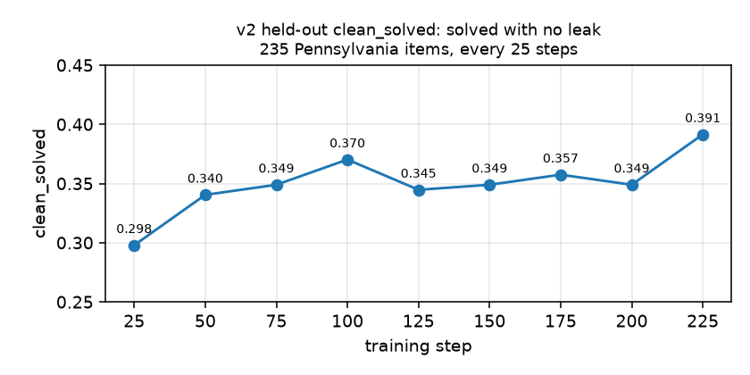

# Run v2 — state assessments

Job `19405111` · 250 steps · 2h11m · 8,000 dialogues ·
[wandb](https://wandb.ai/eduLLM/grpo_tutor/runs/19405111) · weights in
`checkpoints/`, not yet archived · code `cb9dba9` (committed after launch; the
cluster copy was checksummed against it and matches)

## Setup


|          |                                                                                                                                           |
| -------- | ----------------------------------------------------------------------------------------------------------------------------------------- |
| teacher  | Qwen2.5-3B-Instruct + LoRA r=32, lr 5e-6, KL coef 0.03 (v0 and v1 used 0.05)                                                              |
| student  | Qwen2.5-0.5B-Instruct, frozen, scores MC by length-normalised log-prob; persona adapter on `reply()` only                                 |
| task     | 308 released state-assessment items — CA 153, TX 66, MA 65, NJ 24, grades 3-11, baseline-screened. All 308 trained on, 3.2 exposures each |
| reward   | `-1` if the tutor leaked, else solved(own) − solved(other problem | same hint)                                                            |
| dialogue | up to 3 teacher turns, mean 2.57, oracle stop once the student can answer                                                                 |
| eval     | every 25 steps on all 235 Pennsylvania items, unscreened — a different state, different authors, different year                           |
| infra    | H100 on `mit_preemptable`. No preemption; steps 0-249 each logged once                                                                    |


## Headline

**Leaking fell 38%. Teaching did not move. But the teaching that is there is
real, which kills v0's main conclusion.**

## Generic help is gone

v0 found the tutor's hint was worth no more than a random other hint, and read
its +0.100 gain as generic encouragement. Not true here. Nine evals, n=235:

```
no hint at all                  0.489
a hint for a DIFFERENT problem  0.495    +0.006
the tutor's own hint            0.552    +0.063
```

A wrong-problem hint is worth nothing. 91% of the gain is question-specific,
positive in 9 of 9 evals, and training-side specificity over 8,000 dialogues is
+0.162 ± 0.006. That is what the corpus change was for: state golds are 4 words
median and 19% single-word against OpenBookQA's 2 and 31%, so explaining and
revealing stopped being the same act.

It just never grew:

```
step    25    50    75   100   125   150   175   200   225
spec  .106  .051  .038  .034  .034  .047  .081  .064  .060
```

Mean +0.057, slope −0.007 ± 0.026, t = −0.26. The base policy already writes
specific hints. 250 steps of paying for specificity changed that by nothing.

## clean_solved rose, and it means nothing

The new metric — solved with no leak — was the only eval number that moved
(t = +2.75):

```
step           25    50    75   100   125   150   175   200   225
clean_solved .298  .340  .349  .370  .345  .349  .357  .349  .391
```



It is not teaching. `clean_solved` is how well the tutor teaches when it stays
quiet, times how often it stays quiet, and only the second factor moved: the
clean share went 0.545 → 0.719 (t = +2.31) while the solve rate inside those
clean dialogues held at 0.534 ± 0.013 (t = +0.31).

Do not shortcut this as `teacher_acc × (1 − leak_rate)`; that assumes solving
and leaking are independent and they are not. In the traces the student solves
0.346 of the time when the tutor leaked against 0.278 when it did not, so the
independent form over-predicts.

In v0 the leak fix dragged the solve rate down; here it drags this one up. Same
cause both times.

## Leaking

```
step   leak_rate   hint_only_leak   above floor
  25     0.455         0.566           0.306
 125     0.328         0.455           0.196
 225     0.281         0.447           0.187
```

The rule fell (t = −2.31) and the probe followed weakly (t = −1.91), but the
probe still reads 0.166 above the rule at the end against a constant 0.260
floor. Third run where the two disagree on level and agree on direction. Still
unresolved.

## Training side

```
steps      reward   leak   solved  zero_adv     KL    solved|clean   spec
  0- 49    -0.383  0.477   0.358    0.285    0.0035     0.312       +0.204
 50- 99    -0.359  0.409   0.289    0.300    0.0185     0.255       +0.142
100-149    -0.231  0.351   0.319    0.250    0.0223     0.309       +0.176
150-199    -0.229  0.334   0.341    0.270    0.0251     0.325       +0.179
200-249    -0.299  0.354   0.214    0.270    0.0423     0.192       +0.106
```

- Real trends: reward up, leak down, training solve rate down, KL up. Not
specificity.
- `zero_adv_frac` held at 0.27. The screen worked — the unscreened attempt
opened at 0.75 — but a quarter of groups still give no gradient.
- Of 8,000 dialogues: 38.5% scored −1 for leaking, 6.3% scored −1 because the
hint solved the other problem and not its own, 40.4% scored 0, 14.8% earned
+1.


## Math, science and social studies are three different tasks

Splitting the 8,000 dialogues by subject:

```
subject         items  gold length          leaked   spec    solved|clean
math              122  2 words, 30% 1-word   0.334  +0.222      0.369
science            99  6 words, 15% 1-word   0.460  +0.120      0.184
social studies     87  6 words,  8% 1-word   0.372  +0.126      0.237
```

Math wins on every axis at once and science loses on every axis at once.

This contradicts the reason we switched corpora. The argument was that short
gold answers make explaining and revealing the same act — but math golds are 2
words median and 30% single-word, the same shape as OpenBookQA, and math is the
best subject here. Answer length is not the driver. The likelier axis is that a
maths item has a procedure you can walk someone through without saying the
number, while science and history items are recall, where the explanation is
the answer.

The tail collapse is also mostly math: its clean solve rate ran 0.392, 0.381,
0.395, 0.443 and then 0.217 in the last window.

## Why leaking is learnable and teaching is not

Leaking is unilateral and deterministic. The tutor controls it with its own
tokens, it costs −1, and it fires on 38.5% of dialogues — a dense certain
gradient, and the policy took it. Teaching needs a frozen 0.5B student to flip
a log-prob argmax, only 14.8% of dialogues earn anything, and a hint that barely
works scores the same as an excellent one. The reward can say "solved". It
cannot say "more specific".

## The last 50 steps got worse

Solve rate 0.214 against 0.341, solve-given-no-leak 0.192 against 0.325,
specificity +0.106 against +0.179, while KL hit 0.051 — past where v0 sat after
500 steps at a stronger anchor. Dropping `kl_coef` to 0.03 bought drift and the
tail spent it badly. Do not extend this run.

## Readings that are not signal

- *"clean_solved is climbing, teaching works."* It tracks the leak rate. Above.
- *"Specificity recovered after 125."* .034 → .081 → .064 → .060 on a series
whose slope is t = −0.26.
- *"The tutor is going terse."* `hint_words` 103 → 97, inside its own 93-111
range.


## Building the set

- 687 candidates from CA, TX, MA, NJ, grades 3-11. Pennsylvania held out from
the start.
- First screen (`19403509`) kept 246, and called items known as often at grade
11 (66.7%) as at grade 3 (69.2%). On 4-way items with a 25% floor that is
luck, not knowledge.
- Fix (`19403837`): the free-text channel samples, so it runs 3 seeded trials
and an item counts as known only if all three name gold. 187 passed one, 91
passed two, 59 passed all three. Recovered 62 items; final set 308.
- A confidence margin on `choose()` was measured and rejected — raising it makes
the grade profile invert (at 0.50, grade 11 reads 33.3% known against grade
3's 17.3%). The gap tracks string preference, not knowledge.
- What settled it: knowledge is the wrong question. GRPO needs variance in the
group, and `choose()` is deterministic, so an item it gets right by a fluke it
gets right every step. No gradient either way. Plain argmax is the right rule.
Raw per-item measurements are in `data/state_tests/screen_report.jsonl`.


## Pitfalls this run flushed out

- A stale `checkpoints/ckpt.pt` makes a new job adopt the previous run: same run
directory, and it resumes from that checkpoint. A smoke test appended into
v1's finished run; had the real job gone in first it would have loaded v1's
LoRA at step 249 of 250.
- An external eval set stranded 15% of the problems — split off internally, then
replaced by Pennsylvania, so 46 items were trained on by nobody.
- The eval flattered itself. `heldout_eval` ran the oracle `stop_when_solved`,
giving the own-problem condition a solve check every turn while the swapped
condition got one shot. Off now. v1's +0.092 specificity is inflated by this
and is not comparable to +0.057 here.
- `eval/clean_gain` is defined wrong: it reads −0.098 to −0.191 because it
subtracts the full-set baseline from a numerator that counts leaked dialogues
as failures. Ignore it until it is fixed.
- The wandb samples table rendered blank — logged every 10 steps, panel opens on
the last step. Cumulative and flushed at the end now.


## What this says about v3

1. Make the specificity signal dense. `solved(own) − solved(other)` is a
  difference of two rare binary events and 85% of dialogues say nothing about
   teaching. The student's log-prob margin on gold under each hint is graded and
   available every dialogue.
2. Stop making leak reduction compete for the gradient. At −1 on 38.5% of
  dialogues it is where the budget goes. Mask leaked completions out of the
   update instead, or warm-start from this adapter at 0.28 leak.
3. The corpus question is closed. Help is 91% specific; answer shape is not what
  limits the magnitude.
4. Shorter runs. Third run where nothing after ~150 steps changed a conclusion,
  and this time the tail degraded.

